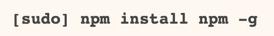
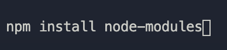
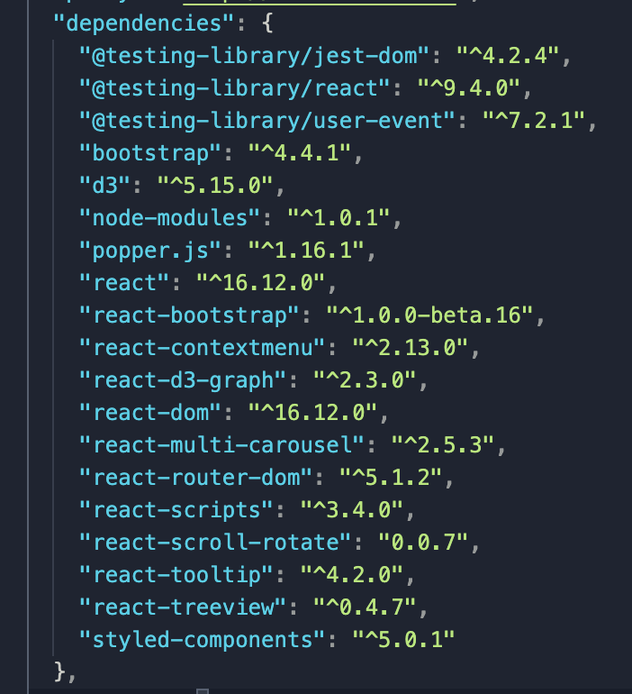

# Algo-Interact

## Documentation
##### Full documentation

## Install 
#### git init and clone repo 

### IDE 

#### In repo open frontend folder into a Visual Studio Code Environmnet 
#### Frontend Folder Location: s2020-djma => algo_interact => frontend

#### install node.js 
#### Link to node install:  https://nodejs.org/en/download/

### Once in environment
#### npm package manner should come with node install if not

#### Next install node_modules 

### Install all the dependencies below

#### Use npm install and then a space between each dependency 

### Get Algo-Interact Running in the Browser
#### Run Reacts local server in the terminal using: npm start 

